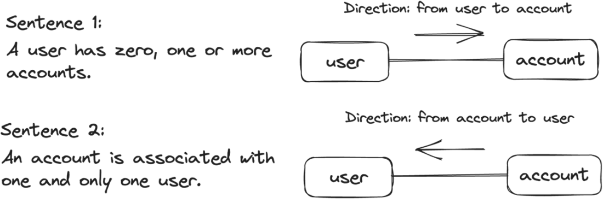
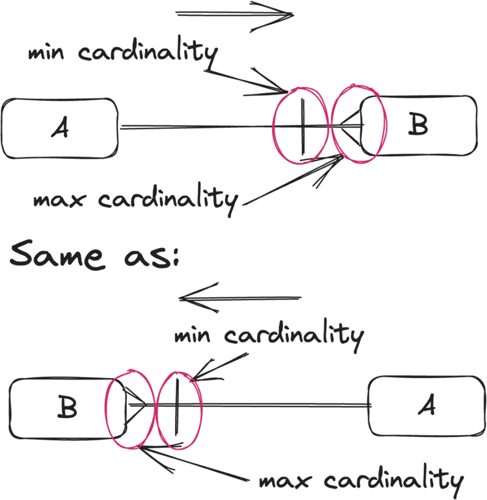
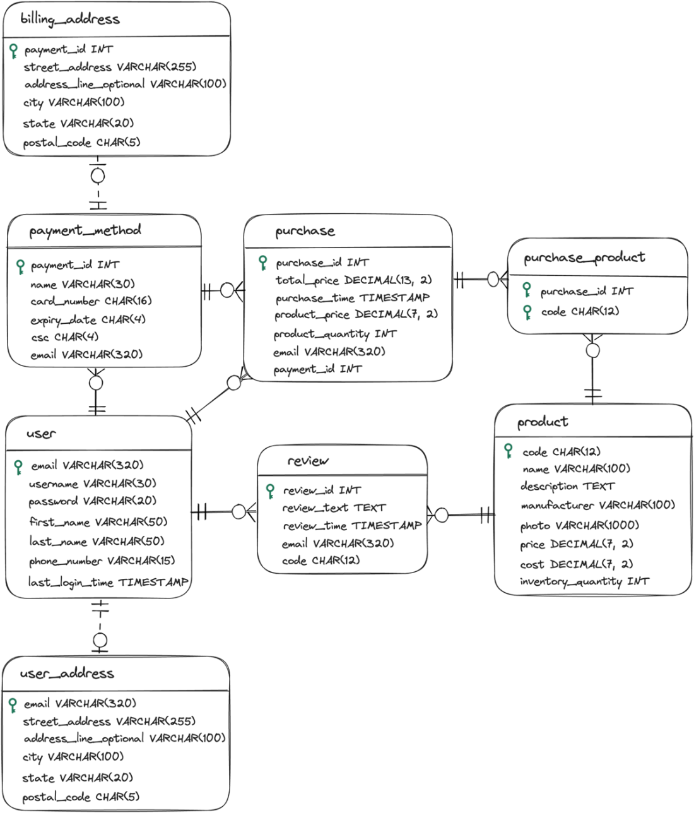

# SQL Cheatsheet
Handy tips for SQL database design and maintanance.

1. Always name constraints.
2. Always use `JOIN` over `WHERE`.
3. Consistent use of IDs (`product_id`).
4. Protected data tampering and encryption in case of leak.
5. After aquiring requirements, design entity-relationship (E-R) diagram.
6. Normalize table into clearer sub-tables after initial E-R design.
7. Test functionality, performance and security post implementation.
8. Stick to single naming convention (Singular or Plural and `first_name` or `firstName`)
9. Define 'candiate keys', the lowest number of attributes required to identify a row.
    - one can be chosen as primary key
10. `FLOAT` & `DOUBLE` should be avoided if every decimal counts (use `DECIMAL` or `NUMERIC` instead).
11. Two tables cannot both have `1-1`, thus relax in this case `0/1 - 1` or `1 - 0.1`.
12. Use junction tables for many-many (`author_book`)
    - make sure to use composite primary keys instead of single primary keys for these tables

# Planning Database

1. Create simple US sentences (_A user makes purchases._)
2. Draw a draft diagram:

3. Think of any missing links and correct draft diagram.
4. Define cardinality:

5. Define strong-weak entities.

# Complex Data Types
## Text
- `CHAR` - Attribute has **uniform length**.
- `VARCHAR` - Relatively **short**, however **varied, lenths**.
- `TEXT` - **Hard to estimate upper-limit** that **regularly exceeds a few thousand characters**.

## Time
> UTC is a consistent worldwide clock.

- `DATE` - Only Date (no time)
- `TIME` - Only Time (no date)
- `DATETIME` - Both date and time (timezone cannot be changed)
- `TIMESTAMP` - Consistent historical moment across timezones.

# Example

# Sources

- [Grokking Relational Database Design](https://www.manning.com/books/grokking-relational-database-design)
- [100 SQL Server Mistakes and How to Avoid Them](https://www.manning.com/books/100-sql-server-mistakes-and-how-to-avoid-them)
- [Learn SQL in a Month of Lunches](https://www.manning.com/books/learn-sql-in-a-month-of-lunches)